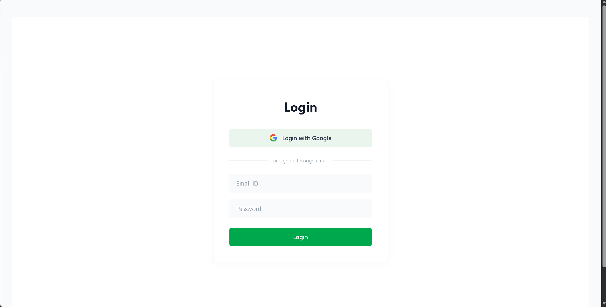
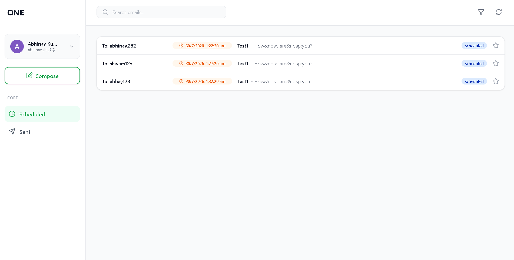
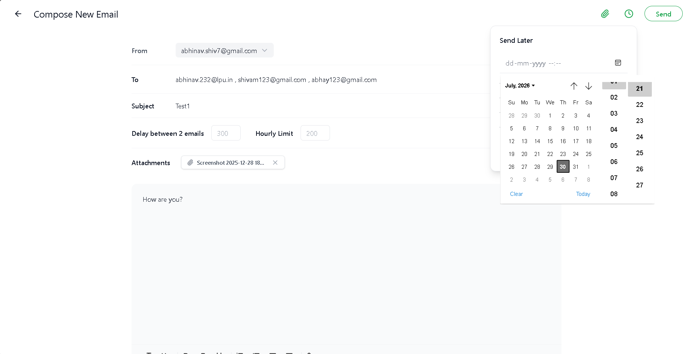
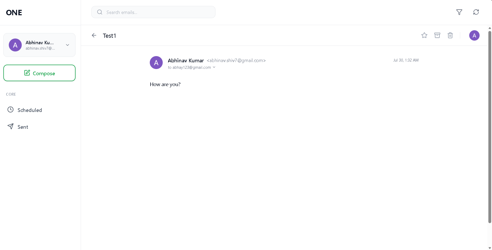
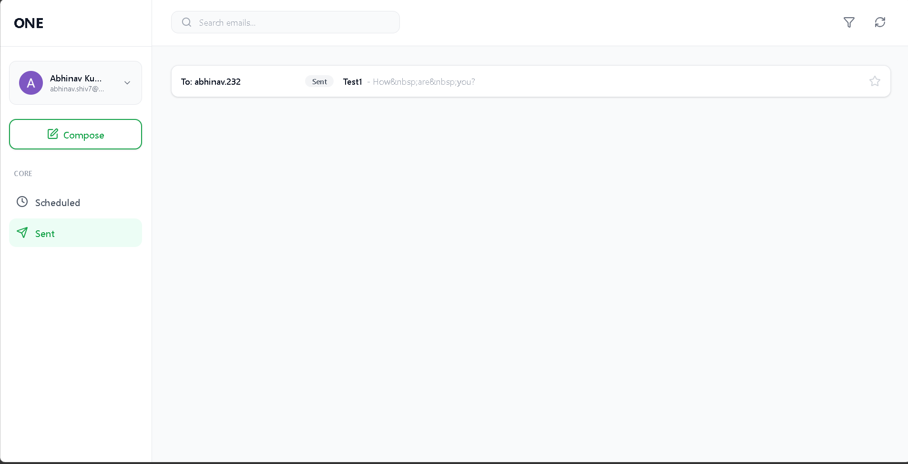
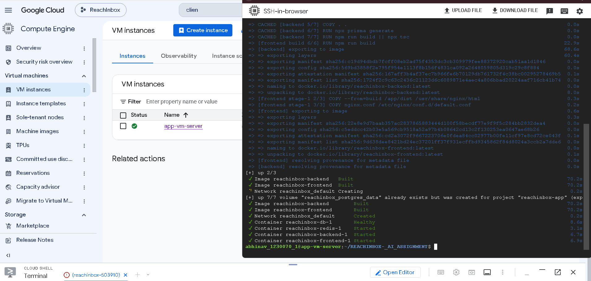

<div align="center">


<br/><br/>

# 📬 ReachInbox — Automated Email Campaign Platform

### *Schedule, deliver, and track email campaigns at scale — with zero infrastructure headaches.*

<br/>

[](http://34.131.249.156.nip.io)

**[→ Open Live App](http://34.131.249.156.nip.io)**

<br/>

</div>

<div align="center">



</div>

---

## 💡 What Is ReachInbox?

**ReachInbox** is a production-grade, full-stack email automation platform designed for high-volume outreach campaigns. Instead of hitting "Send All" and overwhelming inboxes, ReachInbox lets you **precisely control timing, throttle sending rates, and monitor delivery** — all from a clean, intuitive dashboard.

Whether you're reaching out to 10 leads or 10,000, ReachInbox ensures your emails land in inboxes, not spam folders.

---

## ✨ Core Features

| Feature | What It Does |
|---|---|
| 🔐 **Dual Authentication** | Supports both **Google OAuth 2.0** (one-click login) and traditional **Email + Password** registration (with bcrypt hashing) |
| 📋 **Flexible Recipient Entry** | Add recipients manually (comma-separated) or **bulk-upload a CSV file** for large lists |
| ⏱️ **Precision Delay Scheduling** | Set exact delays between individual emails (e.g., 30s between each send) — no blind batch-blasting |
| 🚦 **Smart Hourly Rate Limiting** | Enforces a configurable hourly ceiling to protect your sender reputation and avoid triggering spam filters |
| 📎 **File Attachments** | Attach images, PDFs, and other files to campaigns — stored as Base64 and delivered via Nodemailer |
| 🔄 **Fault-Tolerant Background Queue** | Powered by **BullMQ + Redis**: jobs survive server restarts, crashes, and reconnections transparently |
| 📊 **Live Campaign Dashboard** | Real-time views of Scheduled and Sent emails — with instant search, one-click refresh, and starring |
| 📧 **Detailed Email View** | Click any email to open a rich detail view with full body rendering, sender info, and attachment previews |
| 🐳 **One-Command Deployment** | The entire stack (Frontend, API, PostgreSQL, Redis) boots with a single `docker-compose up --build` |

<div align="center">

| Scheduled Dashboard | Compose New Email |
|---|---|
|  |  |

| Email Detail View | Sent Dashboard |
|---|---|
|  |  |

</div>

---

## 🛠️ Technology Stack

<table>
<tr>
<td valign="top" width="33%">

**🖥️ Frontend**
- React 19 + Vite
- TypeScript
- Tailwind CSS
- TanStack React Query
- React Router v6
- React Quill (rich text editor)
- Lucide Icons

</td>
<td valign="top" width="33%">

**⚙️ Backend**
- Node.js + Express.js
- TypeScript
- BullMQ (job queue)
- Prisma ORM (type-safe DB)
- Nodemailer (email delivery)
- bcryptjs + JSON Web Tokens

</td>
<td valign="top" width="33%">

**🏗️ Infrastructure**
- Docker + Docker Compose
- PostgreSQL 15
- Redis 7
- NGINX (SPA proxy + static serving)
- Google Cloud VM (live deployment)

</td>
</tr>
</table>

---

## 🚀 Quick Start — Docker (Recommended)

Get the entire stack running locally in under 2 minutes:

**Step 1 — Clone the repository:**

```bash
git clone <repo-url>
cd REACHINBOX_AI_ASSIGNMENT
```

**Step 2 — Start all containers:**

```bash
docker-compose up --build -d
```

**Step 3 — Open the app:**

| Service | URL |
|---|---|
| 🌐 Frontend | [http://localhost](http://localhost) |
| ⚙️ Backend API | [http://localhost:8081](http://localhost:8081) |

**Step 4 — Shut down:**

```bash
docker-compose down
```

> **💡 What gets started:** PostgreSQL database, Redis server, Node.js API + BullMQ worker, and NGINX-served React frontend — all via one command.

---

## 💻 Manual Local Development

For active development without Docker:

### Prerequisites

- Node.js (v18+)
- PostgreSQL running locally on port `5432`
- Redis running locally on port `6379`

### Backend

```bash
cd backend
npm install

# Sync Prisma schema to your Postgres DB
npx prisma db push

# Start the dev server with hot-reload
npm run dev
```

### Frontend

```bash
cd frontend
npm install

# Start Vite dev server
npm run dev
```

The frontend will be accessible at `http://localhost:5173`.

---

## 🏛️ Architecture

ReachInbox is built on a **decoupled, event-driven architecture** that separates real-time API requests from slow background operations — ensuring the app remains fast and resilient under load.

```
┌──────────────────┐       ┌────────────────────┐       ┌─────────────────────┐
│  React Frontend  │ ────► │   Express API       │ ────► │   PostgreSQL         │
│  (NGINX / Vite)  │       │   (auth, campaigns) │       │   (Prisma ORM)       │
└──────────────────┘       └──────────┬─────────┘       └─────────────────────┘
                                       │
                                       │  Enqueue job
                                       ▼
                           ┌────────────────────┐
                           │   BullMQ / Redis    │
                           │   (job scheduler)   │
                           └──────────┬─────────┘
                                       │
                                       │  Execute at scheduled time
                                       ▼
                           ┌────────────────────┐
                           │   Worker Process    │ ──► Nodemailer ──► 📧 Inbox
                           │   (rate-limited)    │
                           └────────────────────┘
```

### Layer Breakdown

**1. Frontend (React + NGINX)**
- Static assets built and served by NGINX, with custom routing rules for SPA navigation.
- Global state (search, filters, refresh triggers) shared efficiently via React Router's Outlet Context — no Redux overhead.
- TanStack React Query manages server state with smart caching and background refetching.

**2. API Layer (Express + Prisma)**
- Handles all authentication (JWT issuance, Google OAuth token exchange), campaign creation, and data queries.
- Validates and schedules email jobs into the Redis-backed BullMQ queue.
- Fully type-safe database access via Prisma ORM.

**3. Background Worker (BullMQ)**
- Dedicated worker process continuously polls the Redis queue — completely decoupled from the API.
- BullMQ uses Redis Sorted Sets to wake jobs at their exact scheduled UNIX timestamps — no polling sleep loops.
- Implements atomic Redis `INCR` counters for per-user, per-hour rate limiting. If the limit is hit, the job is transparently moved to the front of the next hour's queue.

**4. Data Layer**
- **PostgreSQL** — persistent storage for `User`, `Campaign`, and `ScheduledEmail` records, including Base64 file attachments.
- **Redis** — ephemeral job queue state, rate-limit counters, and BullMQ metadata.

---

## 🧠 Engineering Highlights

### Precision Delay Scheduling

When a user sets a delay of N seconds between emails, the exact dispatch time for each recipient is computed before the job enters the queue:

```typescript
const exactTime = new Date(startDate.getTime() + (index * delayBetween * 1000));
await emailQueue.add('send-email', jobData, { delay: exactTime - Date.now() });
```

This means BullMQ **never blocks** — it sleeps individual jobs without holding up the event loop or other campaigns.

### Atomic Rate Limiting

Sender reputation protection is enforced using Redis atomic operations:

```typescript
const key = `rate_limit:${userId}:${currentHour}`;
const count = await redis.incr(key);
await redis.expire(key, 3600);  // auto-expire after 1 hour

if (count > hourlyLimit) {
  await job.moveToDelayed(nextHourTimestamp);  // reschedule automatically
}
```

### File Attachments Pipeline

Files selected in the Compose UI are converted to Base64 using the browser's `FileReader` API, stored in PostgreSQL alongside the campaign record, and deserialized by the worker at send-time:

```
Browser FileReader → Base64 string → PostgreSQL (Json field) → Worker → Nodemailer attachment
```

### Resilient Error Recovery

Failed email jobs are automatically retried by BullMQ with exponential backoff. Job status (`scheduled`, `sent`, `failed`) is always written back to PostgreSQL, so the dashboard reflects accurate real-world delivery outcomes.

### File Attachments in Action

<div align="center">


</div>

---

## ☁️ Cloud Deployment

The application is deployed on a **Google Cloud Compute Engine VM** running Ubuntu, accessible at:

### 👉 [http://34.131.249.156.nip.io](http://34.131.249.156.nip.io)

The deployment uses the exact same `docker-compose.yml` used locally — no separate production config needed.

### Deployment Steps

```bash
# 1. SSH into the VM
gcloud compute ssh <instance-name> --zone=<zone>

# 2. Clone the repository
git clone <repo-url>
cd REACHINBOX_AI_ASSIGNMENT

# 3. Start the full stack
docker-compose up --build -d
```

### Infrastructure Overview

| Component | Technology | Notes |
|---|---|---|
| **Compute** | Google Cloud VM (e2-medium) | Ubuntu 22.04 LTS |
| **Reverse Proxy** | NGINX (inside Docker) | Routes `/api/*` to backend, serves SPA on all other paths |
| **Database** | PostgreSQL 15 (Docker volume) | Data persists across container restarts |
| **Queue** | Redis 7 (Docker volume) | BullMQ jobs survive VM reboots |
| **DNS** | nip.io (wildcard DNS) | Maps IP → human-readable domain automatically |
| **Ports** | 80 (HTTP), 8081 (API debug) | Only port 80 exposed publicly via NGINX |

<div align="center">



</div>

---

## 🔁 CI/CD & GitHub Workflow

While this project does not use a fully automated GitHub Actions pipeline (to keep deployment simple for this assignment), the development workflow follows a clean Git branching strategy:

### Branch Strategy

```
main ──────────────────────────────────────────────────► (production-ready)
  └── feature/auth-system
  └── feature/email-scheduler
  └── feature/dashboard-ui
  └── feature/file-attachments
  └── feature/email-view
```

### Recommended GitHub Actions Workflow (for production)

A full CI/CD pipeline for this stack would look like:

```yaml
# .github/workflows/deploy.yml
name: Build & Deploy

on:
  push:
    branches: [main]

jobs:
  deploy:
    runs-on: ubuntu-latest
    steps:
      - uses: actions/checkout@v3

      - name: Build Docker images
        run: docker-compose build

      - name: Run type checks
        run: |
          cd backend && npm run build
          cd ../frontend && npm run build

      - name: SSH Deploy to VM
        uses: appleboy/ssh-action@v1
        with:
          host: ${{ secrets.VM_HOST }}
          username: ${{ secrets.VM_USER }}
          key: ${{ secrets.VM_SSH_KEY }}
          script: |
            cd REACHINBOX_AI_ASSIGNMENT
            git pull origin main
            docker-compose up --build -d
```

### Environment Variables

The following secrets must be set (locally via `.env`, in production via VM environment or GitHub Secrets):

| Variable | Description |
|---|---|
| `DATABASE_URL` | PostgreSQL connection string |
| `REDIS_URL` | Redis connection string |
| `JWT_SECRET` | Secret key for signing JWT tokens |
| `GOOGLE_CLIENT_ID` | Google OAuth 2.0 Client ID |

---

## 📁 Project Structure

```
├── backend/
│   ├── prisma/
│   │   └── schema.prisma          # User, Campaign, ScheduledEmail models
│   ├── src/
│   │   ├── controllers/           # Route handlers (auth, campaigns)
│   │   ├── middlewares/           # JWT auth guard
│   │   ├── routes/                # Express route definitions
│   │   ├── services/              # Campaign scheduler (BullMQ job creation)
│   │   └── worker/
│   │       └── emailWorker.ts     # BullMQ consumer: rate-limits, sends, marks status
│   └── Dockerfile
├── frontend/
│   ├── src/
│   │   ├── api/                   # Axios client with JWT interceptor
│   │   ├── layouts/               # DashboardLayout, AuthLayout
│   │   └── pages/
│   │       ├── Login.tsx          # Google OAuth + Email/Password auth
│   │       ├── Compose.tsx        # Campaign composer with rich text + attachments
│   │       ├── Scheduled.tsx      # Scheduled campaigns dashboard
│   │       ├── Sent.tsx           # Sent campaigns dashboard
│   │       └── EmailView.tsx      # Individual email detail view
│   ├── Dockerfile
│   └── nginx.conf                 # NGINX SPA routing + API proxy
├── screenshots/                   # App screenshots for README showcase
│   ├── s1.png                     # Login page
│   ├── s2.png                     # Scheduled dashboard
│   ├── s3.png                     # Compose email page
│   ├── s4.png                     # Email detail view
│   ├── s5.png                     # Sent dashboard
│   ├── s6.png                     # File attachment UI
│   └── s7.png                     # Docker containers (docker ps output)
└── docker-compose.yml             # Orchestrates all 4 services
```

---

<div align="center">

Built with ⚡ BullMQ &nbsp;·&nbsp; 🐘 PostgreSQL &nbsp;·&nbsp; 🐳 Docker &nbsp;·&nbsp; ⚛️ React

**[🌐 Open Live Demo →](http://34.131.249.156.nip.io)**

</div>
